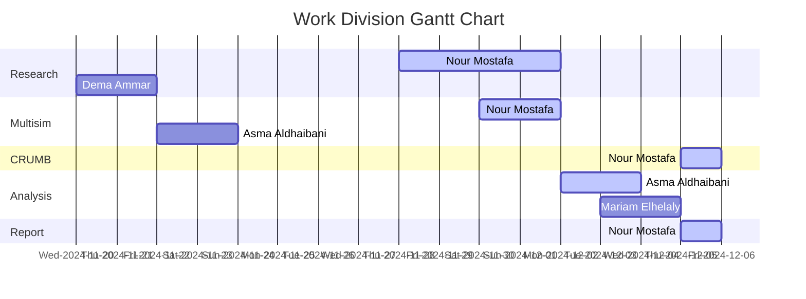

# 
220V AC to 3V DC Power Supply Circuit

Our task is to design a circuit that steps down and rectifies the 220V AC mains voltage of the UAE to 3V DC. The circuit must include a transformer to step down the voltage, a rectifier to convert the AC to DC, a filtering capacitor to smooth the rectified voltage, and a voltage regulator to maintain a steady 3V DC output. We need to calculate the transformer's turns ratio required for stepping down the input voltage, determine the specifications for the rectifier, capacitor, and voltage regulator, and calculate the ripple voltage to ensure it is within acceptable limits. Additionally, we will analyze the power efficiency of the circuit and calculate the maximum current the circuit can supply to the load while maintaining a steady output. Finally, we will simulate this circuit in Multisim to verify the output voltage, current, and ripple characteristics.

---

  

## Introduction

## Apparatus

2. [Capacitor](https://www.ultralibrarian.com/wp-content/uploads/2022/07/shutterstock_731355235-1024x683.jpg): The coupling capacitors at the input and the output will be used to block DC components from entering or exiting a stage while allowing AC signals to pass through. Without coupling capacitors, DC biasing conditions could be disrupted, leading to improper operation of the amplifier stages. The bypass capacitor will be placed in parallel with the source resistor to stabilize the bias point and improve AC signal gain by providing a low impedance path for AC signals. Without bypass capacitors, the gain would be reduced due to the voltage drop across the source resistor.

3. [Resistor](https://static4.arrow.com/-/media/arrow/images/miscellaneous/1123-chart-how-to-read-resistor-color-codes-body-image.jpg): They are needed for a well-biased MOSFET amplifier. R1 & R2 form a voltage divider network to set the gate voltage and ensure the MOSFET is properly biased in the active region. The drain resistor determines the voltage gain and helps to set the operating point of the MOSFET. The source resistor stabilizes the biasing and affects the gain and linearity of the amplifier. It helps in setting the DC operating point and provides feedback to improve stability. The load resistor ensures that the amplifier can drive the load effectively by providing the necessary impedance.

6. [Conductive Wires](https://makerbazar.in/cdn/shop/files/JUMPER-WIRE_8ed6d739-ee06-4590-bbff-c7a413ec8cfc.jpg?v=1705234278): Essential for making electrical connections between different components in the circuit. They provide a pathway for the flow of electric current, ensuring that signals and power can be effectively transmitted throughout the circuit. These wires connect various components such as resistors, capacitors, MOSFETs, and power supplies, forming a complete and functional circuit. They also help in organizing the layout of the circuit on a breadboard, making it easier to troubleshoot and modify.

5. [Breadboard](https://www.elecrow.com/media/magefan_blog/2018/06/How-to-use-a-breadboard.png): An essential tool for prototyping and testing electronic circuits without the need for soldering. They allow for quick and easy assembly and modification of circuits, making them ideal for experimentation and learning. They also support a wide range of components, from resistors and capacitors to ICs and transistors, allowing for the construction of both simple and complex circuits. Breadboards are inexpensive, making them a practical choice for both beginners and professionals.

6. [Multimeter](https://rukminim2.flixcart.com/image/850/1000/kkec4280/multimeter/i/w/p/dt-9205-a-yuv-original-imafzr5fu4haphum.jpeg?q=90&crop=false): A versatile and indispensable tool used for measuring various electrical parameters, including voltage, current, and resistance. When used as an ammeter connected in series, the multimeter measures the current flowing through the circuit. This is crucial for verifying that components are operating within their specified current ratings and for identifying potential issues such as excessive current draw. When used as a voltmeter connected in parallel, the multimeter measures the voltage at different points in the circuit. This helps in ensuring that the circuit is correctly biased, the power supply is stable, and the voltage drops across components are as expected.

7. [Oscilloscope](https://bkpmedia.s3.us-west-1.amazonaws.com/photos/2194_front_lrg.jpg): A critical tool for visualizing the input and output waveforms. It measures various signal parameters, including amplitude, frequency, phase, and wave shape, detecting any distortion or clipping in the amplified signal. It helps in troubleshooting the amplifier. For the single-stage common-source (CS) MOSFET amplifier circuit, I utilized a 2-channel oscilloscope to visualize the input and output waveforms. When dealing with multistage amplifiers, I employed a 4-channel oscilloscope, which allowed me to simultaneously monitor multiple points in the circuit after every stage of amplification.

5. [Function Generator](https://d17bck4wpaw2mg.cloudfront.net/att/a/0/1/l/a01lr4/lek0.jpg): Used to generate input signals (AC) of various types of electrical waveforms (e.g. sine waves, square waves, and triangular waves) of various frequencies and amplitudes for testing the amplifier's performance. It helps in analyzing the frequency response and gain of the amplifier.
   
7. [National Instruments Multisim](https://imag.malavida.com/mvimgbig/download-fs/ni-multisim-9083-1.jpg): A powerful circuit simulation software used for designing, prototyping, and testing electronic circuits. It offers a wide range of tools for simulating analog, digital, and mixed-signal circuits, helping to visualize and analyze circuit behavior in real-time. Multisim's extensive component library makes it ideal for both educational and professional use.

The detailed calculations regarding the values chosen for each of the circuit building components and any supporting assumptions will be thoroughly elaborated in the subsequent section, to provide a comprehensive understanding of the underlying processes.

## Design Procedure

design justifications
design assumptions
design choices 

## Implementation & Testing 

## Result Analysis

### Calculating 

### Calculating 

## Future Improvements

## Conclusion

Summary of success and results in agreement with calculations

### Lessons Learned

1. 
 

We extend our sincere appreciation to Dr. Ali Al Ataby for his insightful feedback which has significantly contributed to the completion of this project.
This publication adheres to all regulatory laws and guidelines established by the American University of Ras Al Khaimah (AURAK) regarding the dissemination of academic materials.

## Resources
|1| 
