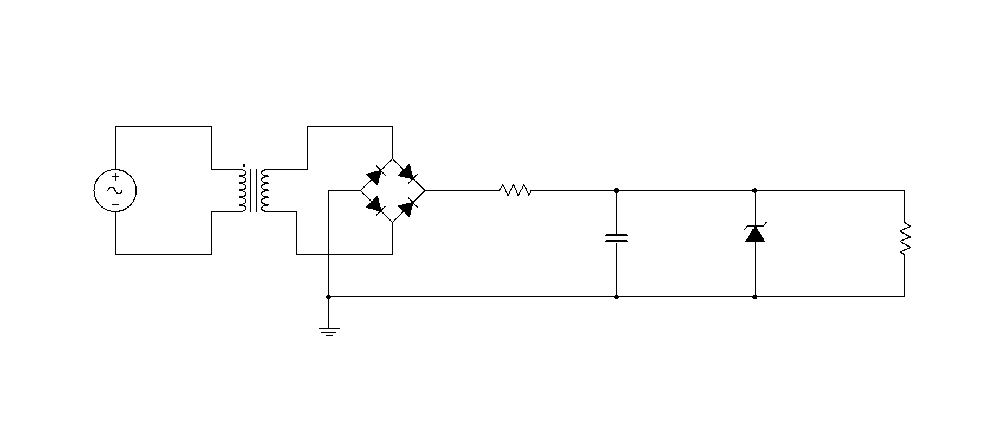
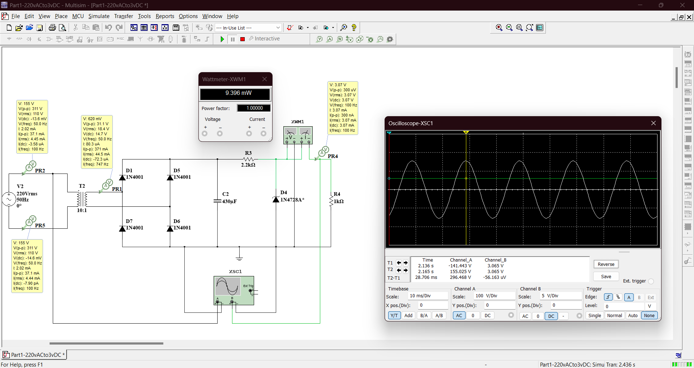
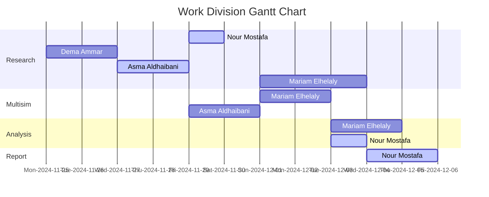

  

<!-- Badge icons found at https://feathericons.com/-->

  

  This report is Markdown-typed and submitted by student Nour Mostafa with ID 2021004938 in partial fulfillment of the requirements for the Bachelor of Science (B.Sc.) degree in Computer Engineering. This paper is best viewed in dark mode. To adjust your settings, go <a href="https://github.com/settings/appearance">here</a>.

# 
220V AC to 3V DC Power Supply Circuit

Our task is to design a circuit that steps down and rectifies the 220V AC mains voltage of the UAE to 3V DC. The circuit must include a transformer to step down the voltage, a rectifier to convert the AC to DC, a filtering capacitor to smooth the rectified voltage, and a voltage regulator to maintain a steady 3V DC output. We need to calculate the transformer's turns ratio required for stepping down the input voltage, determine the specifications for the rectifier, capacitor, and voltage regulator, and calculate the ripple voltage to ensure it is within acceptable limits. Additionally, we will analyze the power efficiency of the circuit and calculate the maximum current the circuit can supply to the load while maintaining a steady output. Finally, we will simulate this circuit in Multisim to verify the output voltage, current, and ripple characteristics.

---

  

## Introduction

A 220V AC to 3V DC power supply circuit is an electronic system designed to convert high-voltage alternating current (AC) from the mains supply into a low-voltage direct current (DC) output suitable for powering low-voltage electronic devices. The design process involves several stages, starting with a step-down transformer that reduces the 220V AC input to a lower AC voltage level, such as 6V AC, which is suitable for rectification. The rectification stage then converts this low-voltage AC into pulsating DC using a rectifier, which can be a half-wave, full-wave, or bridge configuration depending on the desired efficiency and performance. Following rectification, a filtering stage smoothens the pulsating DC voltage by using capacitors to remove AC ripples. To ensure a stable and accurate 3V DC output, a voltage regulation stage is implemented using a voltage regulator, such as a Zener diode. Throughout the design, several considerations are essential, including safety, isolation from high-voltage AC, proper transformer selection, and efficient power regulation to minimize heat loss. 

A __transformer__, the heart of the initial stage in many power supply circuits, is an essential electrical device that operates on the principle of electromagnetic induction to transfer electrical energy between two or more windings, typically at different voltage levels. It consists of primary and secondary windings wound around a magnetic core, which helps transfer energy efficiently through a changing magnetic field when an alternating current (AC) flows through the primary winding. Transformers are broadly classified into several types based on their function and design. Step-down transformers are used to reduce high input voltage to a lower output voltage, making them ideal for power supplies where a lower, safer voltage is required for devices. Conversely, step-up transformers increase the voltage level, often used in power transmission systems to minimize energy loss during long-distance transport. Isolation transformers are employed to electrically isolate the input and output circuits, ensuring safety and protecting sensitive components from electrical noise or faults. Autotransformers, which share a single winding for both input and output, are compact and more efficient but do not provide electrical isolation. Lastly, instrument transformers, including current and voltage transformers, are used for measurement and protection in high-voltage systems, ensuring safe monitoring of power without direct exposure to high voltages. Through these various types, transformers play a vital role in adapting voltage levels, ensuring energy efficiency, and enhancing the safety and performance of electrical systems across numerous applications.

__Rectifiers__ are essential components in power supply systems that serve the critical function of converting alternating current (AC) into direct current (DC), which is necessary for powering most electronic devices. Rectifiers are broadly classified into three main types: half-wave, full-wave, and bridge rectifiers, each with its own operating principles and efficiency levels. Half-wave rectifiers are the simplest form, utilizing a single diode to allow only one half of the AC waveform—either positive or negative—to pass through while blocking the other half. Although this approach is straightforward and cost-effective, it is inherently inefficient as it wastes half of the AC signal, resulting in lower power output and significant ripple. Full-wave rectifiers, on the other hand, make use of two diodes in conjunction with a center-tap transformer. This configuration allows both halves of the AC waveform to be rectified, significantly improving efficiency by utilizing the entire waveform. The center-tap transformer splits the AC voltage into two equal but opposite signals, and each diode conducts during one half-cycle, ensuring that the output voltage is smoother compared to a half-wave rectifier. However, the use of a center-tap transformer adds complexity and cost to the design. Lastly, bridge rectifiers are the most widely used and efficient type, consisting of four diodes arranged in a bridge configuration. Unlike full-wave rectifiers, bridge rectifiers do not require a center-tap transformer, making them more compact and cost-efficient. The four diodes work together to rectify both halves of the AC waveform, ensuring continuous conduction and producing a more stable DC output with minimal ripple. Bridge rectifiers are preferred for their superior performance, higher efficiency, and versatility in a wide range of applications. Collectively, rectifiers form the backbone of AC-to-DC conversion systems, ensuring that electrical devices receive the steady and reliable DC voltage required for their operation.

A __Zener diode__ acts as a voltage regulator by exploiting its ability to maintain a stable voltage across its terminals when reverse-biased beyond its breakdown voltage. Unlike regular diodes, which fail under reverse breakdown, the Zener diode is designed to operate reliably in this region. When the input voltage exceeds the Zener breakdown voltage, the diode conducts in reverse, allowing excess current to bypass the load while clamping the voltage to the Zener voltage. This property ensures that the output voltage remains constant regardless of fluctuations in the input voltage or variations in load current, as long as the current through the Zener diode stays within its safe operating limits. By placing the Zener diode parallel to the load, it stabilizes the voltage and protects sensitive components from overvoltage, making it an essential component in low-power voltage regulation circuits.

In today's modern world, electronic devices are deeply embedded in nearly every aspect of our daily lives, from smartphones and laptops to home appliances and wearable technology. These devices have become indispensable, with many of us relying on them for communication, entertainment, work, and even healthcare. As we continue to integrate technology into every part of our routines, the need for reliable and efficient power supply systems becomes increasingly important. Every device, whether it's charging a smartphone or powering a home appliance, requires a stable and consistent power source to function optimally. This project, focused on designing and understanding power supply circuits, is crucial because it addresses the fundamental need for energy in an electronic-dependent world. By ensuring that devices can be properly powered, we enable the seamless operation of modern technology, which ultimately supports the convenient and connected lifestyle we enjoy today.

## Apparatus

6. [AC Voltage Source](https://download.ni.com/support/manuals/374485a.pdf): provides the input electrical energy needed to power the circuit. This could come from a mains power supply, such as the 220V AC commonly found in residential buildings. The AC source alternates in polarity and voltage, providing the necessary energy for the transformer to step down and for the diodes to rectify it into DC. Without the AC voltage source, the circuit would not function, as there would be no input power to convert and regulate.

5. [Transformer](https://www2.seas.gwu.edu/~ece20/spring15/labs/tutorials/ECE_2115_Tutorial_2_Simulating_Transformers_in_Multisim.pdf): plays a key role in stepping down the input AC voltage from a higher value (such as 220V AC) to a lower, more manageable value that is suitable for the circuit and the devices being powered (such as 5V or 12V DC). The transformer works on the principle of electromagnetic induction, where the primary coil receives the input voltage and generates a magnetic field that induces a voltage in the secondary coil. By adjusting the turns ratio between the primary and secondary windings, the transformer can change the voltage to the required level.

2. [Diodes](https://www.vishay.com/docs/88503/1n4001.pdf): The diodes in this circuit are responsible for rectifying the AC voltage, converting it into a unidirectional (DC) flow. This process is crucial because most electronic devices, including smartphones, require DC power to operate. In this case, the diodes form a bridge rectifier configuration that allows the current to flow during both halves of the AC cycle, ensuring that the output is a full-wave rectified DC signal. The diodes also prevent reverse current from flowing, which could damage the power supply or other sensitive components.

2. [Capacitor](https://www.ultralibrarian.com/wp-content/uploads/2022/07/shutterstock_731355235-1024x683.jpg): serves the vital role of filtering the rectified DC voltage. After the AC voltage is converted into pulsating DC by the diodes, the capacitor smooths out these ripples, creating a more stable DC output. The capacitor charges during the peak of the AC waveform and discharges during the lower part of the waveform, filling in the gaps to reduce voltage fluctuations.

2. [Zener Diode](https://www.vishay.com/docs/85816/1n4728a.pdf): acts as a voltage regulator, ensuring that the output voltage remains constant despite variations in input voltage or load conditions. It does this by allowing current to flow normally in the forward direction but clamps the reverse voltage to a specific, predetermined value (its Zener voltage). Once the output voltage exceeds the Zener diode's rated voltage, it starts to conduct in reverse, preventing the voltage from rising above a safe level and protecting the components downstream, such as the load or the battery being charged.

3. [Resistors](https://static4.arrow.com/-/media/arrow/images/miscellaneous/1123-chart-how-to-read-resistor-color-codes-body-image.jpg): The resistors in this circuit serve various functions, including limiting the current to safe levels and helping to control the voltage drop across specific parts of the circuit. They can be used to adjust current flow through components, such as the Zener diode, or to provide feedback for stabilizing the voltage regulation. The resistors are also part of the load on this circuit. The load resistor in a power supply circuit plays a critical role in determining the current flow and the behavior of the circuit under operation. It represents the device or component that is being powered by the circuit. The design of the power supply must account for the expected load resistance to ensure stable operation and prevent overloading.

6. [Conductive Wires](https://makerbazar.in/cdn/shop/files/JUMPER-WIRE_8ed6d739-ee06-4590-bbff-c7a413ec8cfc.jpg?v=1705234278): Essential for making electrical connections between different components in the circuit. They provide a pathway for the flow of electric current, ensuring that signals and power can be effectively transmitted throughout the circuit. These wires connect various components such as resistors, capacitors, and power supplies, forming a complete and functional circuit. They also help in organizing the layout of the circuit on a breadboard, making it easier to troubleshoot and modify.

7. [Oscilloscope](https://bkpmedia.s3.us-west-1.amazonaws.com/photos/2194_front_lrg.jpg): is used for monitoring and analyzing the waveform of the voltage at different points in the circuit. It allows the user to visualize the AC input, the rectified DC output, and the effects of the filtering and regulation process. By observing the voltage waveform on the oscilloscope, engineers and technicians can ensure that the circuit is functioning correctly, that the voltage is stable, and that there are no excessive ripples or fluctuations. It helps to diagnose issues, such as improper rectification or regulation, and provides real-time feedback on the performance of the power supply.

7. [National Instruments Multisim]([https://imag.malavida.com/mvimgbig/download-fs/ni-multisim-9083-1.jpg](https://download.ni.com/support/manuals/374483a.pdf)): A powerful circuit simulation software used for designing, prototyping, and testing electronic circuits. It offers a wide range of tools for simulating analog, digital, and mixed-signal circuits, helping to visualize and analyze circuit behavior in real-time. Multisim's extensive component library makes it ideal for both educational and professional use.

The detailed calculations regarding the values chosen for each of the circuit building components and any supporting assumptions will be thoroughly elaborated in the subsequent section, to provide a comprehensive understanding of the underlying processes.

## Design Procedure

design justifications
design assumptions
design choices 

You cannot represent a smartphone's load as a fixed 1k ohm resistor in your circuit because the resistance of a smartphone during charging is not constant and varies dynamically based on factors like the battery's state of charge, charging mode (standard vs. fast charging), and internal circuitry. Smartphones do not behave like passive resistors, as their current draw depends on the charging stage and the internal charging circuitry. For example, during fast charging, the phone actively negotiates higher voltages and currents (e.g., 9V, 2A), which translates to a much lower effective resistance, calculated by Ohm’s law as $$R = \frac{V}{I} = \frac{5V}{2A} = 2.5 \, \Omega$$. A 1k ohm resistor, on the other hand, would limit the current to $$I = \frac{V}{R} = \frac{5V}{1000 \, \Omega} = 5 \, \text{mA}$$, which is far too small for proper charging (most phones need at least 1A to 3A). The phone’s battery and its management system act as a complex, nonlinear load, with the battery's internal resistance changing depending on its charge level and temperature. For instance, during the early stages of charging, the resistance is lower to allow higher current flow, and as the battery fills up, the current decreases, and the effective resistance rises. Modern smartphones use buck converters or similar circuits to regulate the input power efficiently, adjusting the current and voltage dynamically. Thus, a smartphone’s resistance is much lower than 1k ohm and varies as it charges. To simulate a phone’s behavior accurately in a circuit, a dynamic load model or a current sink can be used, with typical charging scenarios having an effective resistance of $$R = 5 \, \Omega$$ for standard charging (5V, 1A), $$R = 4.5 \, \Omega$$ for fast charging (9V, 2A), and $$R = 4 \, \Omega$$ for higher power charging (12V, 3A). Despite this, however, we will design our circuit with the assumption that we have a fixed load. Later, we will calculate the range of load values that this circuit can effectively havdle without the DC output value being sabotaged.

In my Multisim simulation, through steps [1](Photos/howtocustomize.png) and [2](Photos/customizing-the-diode-in-multisim.png), I customized the 1N4728A Zener diode to have a breakdown voltage rating of 3.0V, instead of its original 3.3V rating, as I was unable to find a component in the library that met my specific requirements. Since the 1N4728A was the closest available option, I modified its parameters by adjusting the breakdown voltage setting within the component properties. This allowed me to simulate the desired behavior of the Zener diode for my circuit, despite the library limitation. Although this modification is only an approximation, it enables me to model the voltage regulation characteristics I need for the project. This was also a good exercise, as we had never before edited the parameters of the components in the Multisim database. Learning how to modify and adjust these parameters allowed us to customize the behavior of the components in the circuit to better suit our design requirements, providing deeper insights into the simulation process. This is why you will find a star next to the component's name in the simulation photos in the next section.

## Implementation & Analysis 

  

## Future Improvements

## Conclusion

Summary of success and results in agreement with calculations

A 3V supply is commonly used for low-power electronic devices and systems that require minimal current. It is particularly popular in small battery-operated devices because 3V can be conveniently provided by two 1.5V batteries (such as AA or AAA cells) connected in series or through coin cell batteries like the CR2032, which are widely used due to their compact size and long shelf life. Devices that typically use a 3V supply include remote controls, wristwatches, calculators, small sensors, and other consumer electronics. Many microcontrollers, such as those used in embedded systems and IoT devices, also operate at 3V or 3.3V, as this voltage is sufficient to power their internal circuits while minimizing energy consumption. Memory devices like EEPROMs, low-power LEDs, and certain wireless communication modules (e.g., Bluetooth Low Energy) also rely on 3V or 3.3V power supplies for efficient and stable operation. Additionally, 3V is often seen in CMOS-based digital logic circuits and systems, as it meets their low-voltage requirements without compromising functionality. Overall, 3V power supplies are ideal for applications where energy efficiency, small size, and low power consumption are critical considerations.

The typical DC voltage needed to charge phones nowadays is 5 volts, which is the standard voltage used by most USB charging ports and adapters. This voltage is regulated and supplied through USB Type-A, Type-C, or other USB connectors, ensuring compatibility with a wide range of smartphones and devices. Modern phone chargers often incorporate advanced technologies like fast charging or quick charging, which can deliver higher power by increasing the current (measured in amperes) or temporarily boosting the voltage to levels such as 9V, 12V, or even higher, depending on the device and charger compatibility. For instance, technologies like USB Power Delivery (USB-PD) or Qualcomm's Quick Charge allow devices to negotiate with the charger for higher voltages and currents, enabling faster charging without damaging the phone's battery. Despite these advancements, the initial 5V standard remains the baseline for most phone chargers, ensuring universal compatibility and safe charging for a variety of devices, especially older models or when connected to standard USB ports.

The Ohm load of devices, such as phones, represents the equivalent resistance seen by the AC-to-DC circuit supplying power to the device. This resistance is not static but varies dynamically depending on the charging stage, the battery's internal resistance, and the current drawn during the charging process. For phones, the load can be approximated using Ohm’s Law (V = IR). At 5V, with a charging current of about 1A to 3A (common in standard and fast-charging scenarios), the equivalent resistance (R = V/I) ranges from approximately 1.67 ohms to 5 ohms. When fast charging with higher voltages like 9V or 12V, the effective resistance becomes lower as the current increases, allowing for faster energy delivery to the device. In other devices requiring power supplies, the ohm load similarly depends on their voltage and current needs. For example, LED strips often run at 12V DC, drawing currents from 0.5A to 2A, which corresponds to an equivalent resistance of 6 ohms to 24 ohms. Microcontroller-based systems or sensors, which typically operate at 3.3V or 5V, might draw smaller currents like 100mA to 500mA, yielding resistances of 6.6 ohms to 50 ohms. Larger systems, such as laptop chargers operating at 19V DC with currents around 3A to 6A, see a load of 3.2 ohms to 6.3 ohms. Industrial equipment or motors operating at higher DC voltages, like 24V or 48V, may draw significant current, resulting in correspondingly lower ohm loads.

In commercial practice, discussions about chargers and power supplies primarily focus on their power rating (measured in watts) and their DC voltage output. The power rating provides a straightforward measure of the supply’s ability to deliver energy, calculated as $P = V \times I$. For example, a phone charger may be advertised as a 10W (5V, 2A) or 18W (9V, 2A) fast charger. Higher-wattage ratings, such as 65W or 100W USB-C chargers, are often used for laptops or multi-device charging. Voltage ratings are also significant, especially when compatibility with specific devices is required, as seen with the 5V standard for USB ports or specialized voltages for industrial and computing systems. However, power (in watts) tends to headline discussions because it reflects the overall capability of the power supply to deliver energy, while voltage and current specifications are provided to ensure compatibility and safety with devices.

We extend our sincere appreciation to Dr. Ali Al Ataby for his insightful feedback which has significantly contributed to the completion of this project.
This publication adheres to all regulatory laws and guidelines established by the American University of Ras Al Khaimah (AURAK) regarding the dissemination of academic materials.

## Resources
|1| AC/DC Power Supply Design in 7 Steps. (n.d.).   http://www.fsp-group.com/en/knowledge-tec-23.html  
|2| Brief-Biography (Director). (2017, October 8). Convert AC 220v to DC 12v Circuit Simulate in Proteus.   https://www.youtube.com/watch?v=9UaQQE9GXqg  
|3| brmarcum. (n.d.). AC to DC Conversion. Instructables.   https://www.instructables.com/AC-to-DC-Conversion/  
|4| DIY Circuits (Director). (2020, May 17). How to make 220v AC to 3v DC converter.   https://www.youtube.com/watch?v=7UsdRUU8Xq8  
|5| Power Supplies | Electronics Club. (n.d.).   https://electronicsclub.info/powersupplies.htm  
|6| RJ EDIT ALL (Director). (2024, January 7). Convert 220v ac to 3v 6v 9v 12v 24v 48v DC Out driver Circuit, multi converter.   https://www.youtube.com/watch?v=JuAzHa5LNWc  
|7| sncarter. (n.d.). The Simplest, Cheapest 3.3V Power Supply in the Universe. Instructables.   https://www.instructables.com/The-Simplest-Cheapest-33V-Supply-in-the-Universe/  
|8| The Engineer Solutions (Director). (2020, November 27). How to Make a Power Supply in Ni-Multisim | 5 volt power supply.   https://www.youtube.com/watch?v=FCmUJJs09o8  
|9| The Organic Chemistry Tutor (Director). (2020, February 5). 220V AC to 12V DC Converter Power Supply Using Diodes, Capacitors, Resistors, & Transformers. https://www.youtube.com/watch?v=lKhmNanDkPY  
