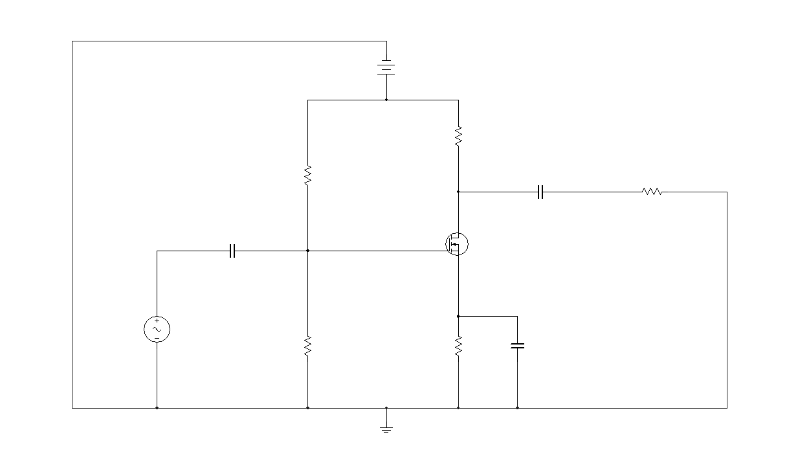
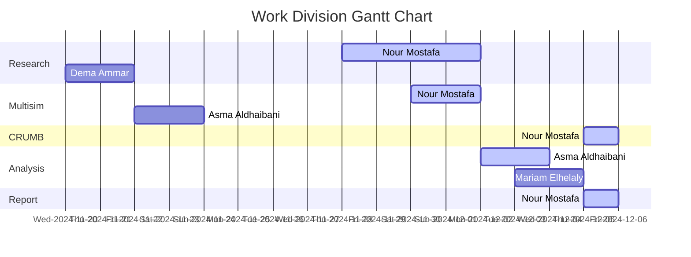

# 
MOSFET Audio Amplifier with Low Distortion (20Hz-20KHz)

Our task is to design an amplifier using a MOSFET transistor with minimal distortion, suitable gain, and capable of driving a 32-ohm load. We aim for a frequency response from 20 Hz to 20 kHz and sufficient power output, assuming the available DC supply is between 10V to 20V. We need to choose a suitable transistor and justify our choice, perform both DC and AC analysis, calculate the gain, input impedance, output impedance, and output power. Additionally, we must simulate the circuit in NI Multisim and use the frequency response function to prove a flat response over the required range. The amplifier can be any circuit of our choice.

---

  

## Introduction

A __MOSFET__ (Metal-Oxide-Semiconductor Field-Effect Transistor) is a type of transistor widely used for switching and amplification applications in electronic devices. At its core, a MOSFET is a voltage-controlled device that operates by manipulating the electrical conductivity of a channel through which carriers (electrons or holes) flow. The structure consists of three main terminals: the Gate, Drain, and Source. The Gate terminal is insulated from the channel by a thin layer of oxide, which controls the flow of carriers between the Drain and Source terminals. When a voltage is applied to the Gate, it creates an electric field that modulates the conductivity of the channel, effectively turning the transistor on or off. There are two primary types of MOSFETs: Enhancement and Depletion. Enhancement MOSFETs are normally off and require a positive gate-to-source voltage to conduct, making them ideal for low-power switching applications. Depletion MOSFETs, on the other hand, are normally on and require a negative gate-to-source voltage to turn off. MOSFETs are prized for their high input impedance, fast switching speeds, and low power consumption, making them essential components in modern electronics, from microprocessors to power management systems. Their versatility and efficiency have cemented their role as a foundational element in both digital and analog circuits.

An __amplifier__ is an essential electronic device designed to increase the power, voltage, or current of a signal. Its primary function is to take a weak input signal and produce a stronger output signal without significantly altering the original signal's shape. Amplifiers are integral to a wide range of applications, from audio systems and broadcasting to telecommunications and signal processing. They consist of active components like transistors or operational amplifiers, which use power from a power supply to boost the amplitude of the input signal. The performance of an amplifier is characterized by parameters such as gain, bandwidth, efficiency, linearity, and noise. Gain refers to the ratio of the output signal strength to the input signal strength, while bandwidth defines the range of frequencies over which the amplifier can effectively operate. Efficiency indicates how well the amplifier converts input power into output power, with minimal loss as heat. Linearity ensures that the output signal is a faithful reproduction of the input signal, with minimal distortion. Noise performance is critical as it determines how much unwanted random signals are added to the amplified signal.

MOSFET transistors can be configured in different arrangements to function as amplifiers, each offering unique characteristics suited to specific applications. The three common configurations are Common Source (CS), Common Drain (CD), and Common Gate (CG).
1. __Common Source (CS):__ This is the most widely used MOSFET amplifier configuration. In a CS amplifier, the Source terminal is common (i.e. grounded) to both the input and output signals. This arrangement provides high voltage gain and is commonly used in audio and radio-frequency amplification. The output signal is inverted relative to the input signal. In a CS amplifier, the input voltage applied to the Gate modulates the current flow between the Drain and Source. A positive input voltage increases the Gate-to-Source voltage ($V_{GS}$), which increases the current from Drain to Source ($I_{DS}$). This increased current causes a greater voltage drop across the Drain resistor ($R_D$) because according to Ohm's law (V = IR), an increase in current through $R_D$ results in an increase in the voltage drop across it. The voltage at the Drain ($V_D$) is taken as the output. As the current through $R_D$ increases, the voltage drop across $R_D$ increases, which means the voltage at the Drain (relative to the Source) decreases. Consequently, an increase in input voltage (Gate voltage) results in a decrease in output voltage (Drain voltage), creating an inverted output signal.
2. __Common Drain (CD):__ Also known as a Source Follower, this configuration features the Drain terminal common to both the input and output signals. It is primarily used for impedance matching due to its high input impedance and low output impedance. This circuit is a voltage buffer, meaning it provides a unity gain (approximately equal input and output voltage) while buffering the signal. Its high input impedance ensures minimal loading on the preceding stage of the circuit. Its low input impedance is ideal for driving low-impedance loads efficiently. There is no phase inversion in the output signal.
3. __Common Gate (CG):__ In this configuration, the Gate terminal is common to both input and output signals. It is less common but useful in high-frequency applications due to its low input impedance and high output impedance. It's effective for high-frequency signal amplification. The output signal maintains the same phase as the input signal.

Operating a MOSFET as an amplifier requires specific conditions to be met for the device to function effectively in amplifying a signal. 
1. Proper biasing of the MOSFET is crucial to ensure it operates in the active region (also known as the saturation region for a MOSFET) of its characteristics. This is achieved by setting an appropriate Gate-to-Source voltage ($V_{GS}$) such that the MOSFET remains on and can modulate the current through the Drain-Source channel based on the input signal. Proper biasing ensures that the device does not enter cutoff (off state) or the ohmic (linear) region, where it would function more like a resistor rather than an amplifier.
2. The Gate-to-Source voltage ($V_{GS}$) must be greater than the threshold voltage ($V_{TH}$) of the MOSFET. This threshold voltage is the minimum $V_{GS}$ needed to create a conductive channel between the Drain and Source.
3. The Drain-Source voltage ($V_{DS}$) must be high enough to ensure that the MOSFET remains in the active region. $V_{DS}$ > $V_{GS}$ - $V_{TH}$ for an n-channel MOSFET as this condition helps maintain a constant current through the device for varying Gate voltages, which is essential for linear amplification.
4. A suitable load resistance ($R_D$) must be connected to the Drain. This load resistor helps convert the variations in Drain current (caused by the input signal) into a corresponding output voltage. The value of $R_D$ affects the gain of the amplifier, with a higher $R_D$ providing greater voltage gain.
5. The input signal amplitude must be small enough to ensure that the MOSFET stays within its linear operating range and does not drive the transistor into cutoff or saturation. This maintains the integrity of the amplified signal without distortion or clipping.
6. An appropriate DC power supply must be provided to the MOSFET circuit. The power supply voltage should be sufficient to support the required $V_{DS}$ and the desired output signal swing. It must also be stable to prevent variations that could affect the amplifier's performance.
7. For AC signal amplification, bypass capacitors may be used to stabilize the biasing and ensure consistent operation over the desired frequency range. These capacitors help filter out any unwanted noise or fluctuations and improve the overall stability of the amplifier.

Other key considerations include the signal swing, which refers to the range of the input signal that the amplifier can handle without clipping or distortion. It's essential to design the amplifier so that the output signal maintains its integrity throughout the expected range of input signal levels. This involves selecting appropriate component values and ensuring that the power supply voltage is sufficient. Lastly, the Operating Point (or Q-point) of the amplifier must be set to ensure that the transistor remains in the desired operating region (saturation) throughout the signal cycle. The Q-point is determined by the DC biasing conditions and affects the linearity and distortion of the amplifier. By carefully considering these factors, designers can create amplifiers that deliver high-quality, distortion-free output suitable for various applications.

As for our task, it suggests designing an audio amplifier. I have inferred this using some key clues from the design specifications given in the task statement. Firstly, the amplifier circuit must be one capable of driving a 32-ohm load. This typically refers to the impedance of audio devices like headphones or speakers, which are common loads for audio amplifiers. Minimal distortion was another specification and it is a critical requirement in audio systems to preserve sound quality. A frequency response between 20 Hz to 20 kHz  matches the human audible range, a standard specification for audio amplifiers. The primary function of an audio amplifier is to amplify low-level audio signals from sources like microphones, musical instruments, or audio playback devices to a level that can drive speakers.

## Apparatus

1. [2N7000 MOSFET](https://www.mouser.com/datasheet/2/308/1/ONSM_S_A0018755274_1-3326336.pdf): It is a popular choice for low-power switching and amplification applications due to its low threshold voltage and relatively high transconductance. It offers good performance in small signal amplification, low on-resistance, and can handle moderate current levels efficiently, making it suitable for our amplifier design.

2. [Capacitors](https://www.ultralibrarian.com/wp-content/uploads/2022/07/shutterstock_731355235-1024x683.jpg): The coupling capacitors at the input and the output will be used to block DC components from entering or exiting a stage while allowing AC signals to pass through. Without coupling capacitors, DC biasing conditions could be disrupted, leading to improper operation of the amplifier stages. The bypass capacitor will be placed in parallel with the source resistor to stabilize the bias point and improve AC signal gain by providing a low impedance path for AC signals. Without bypass capacitors, the gain would be reduced due to the voltage drop across the source resistor.

3. [Resistors](https://static4.arrow.com/-/media/arrow/images/miscellaneous/1123-chart-how-to-read-resistor-color-codes-body-image.jpg): They are needed for a well-biased MOSFET amplifier. R1 & R2 form a voltage divider network to set the gate voltage and ensure the MOSFET is properly biased in the active region. The drain resistor determines the voltage gain and helps to set the operating point of the MOSFET. The source resistor stabilizes the biasing and affects the gain and linearity of the amplifier. It helps in setting the DC operating point and provides feedback to improve stability. The load resistor ensures that the amplifier can drive the load effectively by providing the necessary impedance.

4. [15V and 20V Batteries](https://5.imimg.com/data5/FO/NM/HP/SELLER-9108821/dc-power-supply.jpg): Provide the necessary power supply (voltage and current) to drive the MOSFET and other circuit elements. Without a power supply, the MOSFET cannot be properly biased, leading to it being in an incorrect region. Insufficient power supply voltage can cause the output signal to clip, distorting the amplified signal and potentially damaging the MOSFET or other components.

6. [Conductive Wires](https://makerbazar.in/cdn/shop/files/JUMPER-WIRE_8ed6d739-ee06-4590-bbff-c7a413ec8cfc.jpg?v=1705234278): Essential for making electrical connections between different components in the circuit. They provide a pathway for the flow of electric current, ensuring that signals and power can be effectively transmitted throughout the circuit. These wires connect various components such as resistors, capacitors, MOSFETs, and power supplies, forming a complete and functional circuit. They also help in organizing the layout of the circuit on a breadboard, making it easier to troubleshoot and modify.

5. [Breadboard](https://www.elecrow.com/media/magefan_blog/2018/06/How-to-use-a-breadboard.png): An essential tool for prototyping and testing electronic circuits without the need for soldering. They allow for quick and easy assembly and modification of circuits, making them ideal for experimentation and learning. They also support a wide range of components, from resistors and capacitors to ICs and transistors, allowing for the construction of both simple and complex circuits. Breadboards are inexpensive, making them a practical choice for both beginners and professionals.

6. [Multimeter](https://rukminim2.flixcart.com/image/850/1000/kkec4280/multimeter/i/w/p/dt-9205-a-yuv-original-imafzr5fu4haphum.jpeg?q=90&crop=false): A versatile and indispensable tool used for measuring various electrical parameters, including voltage, current, and resistance. When used as an ammeter connected in series, the multimeter measures the current flowing through the circuit. This is crucial for verifying that components are operating within their specified current ratings and for identifying potential issues such as excessive current draw. When used as a voltmeter connected in parallel, the multimeter measures the voltage at different points in the circuit. This helps in ensuring that the circuit is correctly biased, the power supply is stable, and the voltage drops across components are as expected.

7. [Oscilloscope](https://bkpmedia.s3.us-west-1.amazonaws.com/photos/2194_front_lrg.jpg): A critical tool for visualizing the input and output waveforms. It measures various signal parameters, including amplitude, frequency, phase, and wave shape, detecting any distortion or clipping in the amplified signal. It helps in troubleshooting the amplifier. For the single-stage common-source (CS) MOSFET amplifier circuit, I utilized a 2-channel oscilloscope to visualize the input and output waveforms. When dealing with multistage amplifiers, I employed a 4-channel oscilloscope, which allowed me to simultaneously monitor multiple points in the circuit after every stage of amplification.

5. [Function Generator](https://d17bck4wpaw2mg.cloudfront.net/att/a/0/1/l/a01lr4/lek0.jpg): Used to generate input signals (AC) of various types of electrical waveforms (e.g. sine waves, square waves, and triangular waves) of various frequencies and amplitudes for testing the amplifier's performance. It helps in analyzing the frequency response and gain of the amplifier.
   
7. [National Instruments Multisim](https://imag.malavida.com/mvimgbig/download-fs/ni-multisim-9083-1.jpg): A powerful circuit simulation software used for designing, prototyping, and testing electronic circuits. It offers a wide range of tools for simulating analog, digital, and mixed-signal circuits, helping to visualize and analyze circuit behavior in real-time. Multisim's extensive component library makes it ideal for both educational and professional use.

8. [CRUMB Circuit Simulator](https://shared.cloudflare.steamstatic.com/store_item_assets/steam/apps/2198800/capsule_616x353.jpg?t=1732890458): It stands out by providing a graphically stimulating, realistic 3D environment, unlike other simulation software that typically display only schematic diagrams. Crumb's immersive interface makes it easier for users to visualize and interact with their circuits as they would with physical components. Crumb offers a wide range of components, allowing users to experiment with different circuit designs and configurations and it can be used as a learning educational tool and as a prototype workspace for electronic hobbyists and professionals. This is the closest you can get to a hands-on experience through a computer's screen. First we had breadboards to simulate circuits. Now we got software to simulate breadboards. 

The detailed calculations regarding the values chosen for each of the circuit building components and any supporting assumptions will be thoroughly elaborated in the subsequent section, to provide a comprehensive understanding of the underlying processes.

## Design Procedure

### Choices & Justifications
Enhancement-type MOSFETs are typically preferred for amplifier applications due to their normally-off nature, meaning they only conduct when a suitable gate-to-source voltage is applied. This feature makes them inherently more power-efficient as they do not consume power in the off state, which is ideal for amplification tasks. Additionally, they offer ease of control as a positive gate voltage is sufficient to turn them on, unlike depletion MOSFETs which require a negative voltage to turn off. This simplifies the design and control of amplifier circuits. Moreover, the precise control of gate voltage in enhancement MOSFETs allows for accurate and stable signal amplification, improving overall performance. They also generate less heat, reducing the need for extensive cooling mechanisms, thereby enhancing reliability and lifespan. Furthermore, the efficient operation of enhancement MOSFETs contributes to lower noise levels in the amplification process, resulting in cleaner output signals. All these advantages make enhancement-type MOSFETs the preferred choice for efficient, reliable, and high-performance amplification circuits.

N-channel MOSFETs are often preferred over P-channel MOSFETs in amplifier designs due to several key advantages. Firstly, N-channel MOSFETs typically offer lower on-resistance and higher current-carrying capabilities, which translates to better efficiency and performance in amplification circuits. They have superior electron mobility compared to P-channel devices, allowing for faster switching speeds and reduced power losses. This results in improved overall efficiency of the amplifier. Additionally, the drive voltage required to switch N-channel MOSFETs is generally lower, simplifying the design of the gate drive circuitry and enhancing the ease of control. This lower drive voltage also contributes to reduced power consumption and heat generation, which is critical for maintaining the reliability and longevity of the amplifier. Furthermore, N-channel MOSFETs are more widely available and cost-effective, making them a practical choice for most applications. These factors combined make N-channel MOSFETs the preferred option for high-performance, efficient, and cost-effective amplifier designs.

Our MOSFET needs to be turned on before we can use it, so we need to bias it properly. Biasing a MOSFET ensures that it operates in the desired region. A good bias design ensures that the parameters of the operating point $I_D$, $V_{OV}$, and $V_{DS}$ are predictable, stable, and don't vary by a large amount when the transistor is replaced by another of the same type. There are several types of MOSFET biasing methods, each with its own merits and disadvantages. __Fixed Biasing__ involves applying a constant voltage to the gate using a resistor. This method is simple and easy to implement, but it lacks stability, as variations in the threshold voltage or temperature changes can significantly affect the operating point. __Voltage Divider Biasing__ uses a pair of resistors to create a stable voltage at the gate. This method provides better stability and control over the operating point compared to fixed biasing, but it is more complex to design and requires precise resistor values to maintain the desired bias point. __Self-Biasing or Source Biasing__ involves placing a resistor in the source terminal of the MOSFET. This method provides automatic adjustment of the gate-source voltage based on the current flow, enhancing stability. However, it can reduce the overall gain of the amplifier due to the voltage drop across the source resistor. For our designs, we will be using the classical voltage divider biasing technique.

We will be using the common source configuration of MOSFET amplifiers as it is the most common technique with many resources to refer back to. We didn't use the common drain configuration because it has unity gain (=1), which means it basically acts as a buffer rather than an amplifier. The common gate configuration provides low input impedance and is typically used in high-frequency applications where impedance matching is critical. The range of 20Hz to 20kHz is not considered high frequency in the context of electronics and radio communication. High frequencies generally refer to frequencies in the typical range from 30kHz to 300GHz. Hence, for our project, the common source configuration offers the best balance of gain, simplicity, and available resources, making it the most suitable choice.

In a Common Source MOSFET Amplifier, the source terminal is directly connected to the ground, which generally provides higher voltage gain due to the absence of resistive elements in the source path. However, this configuration lacks stability, as variations in the MOSFET's parameters, such as threshold voltage and temperature changes, can significantly impact the operating point and gain. Linearity can also be compromised because the amplifier could easily enter non-linear regions due to the lack of feedback. In contrast, a Common Source configuration with a Source Resistor $R_S$ includes a resistor in the source path, connecting the source terminal to the ground through the resistor. This setup reduces the voltage gain compared to the simple common source configuration, as the gain is influenced by the value of the source resistor, which provides feedback. However, the inclusion of $R_S$ enhances the stability of the amplifier, introducing negative feedback that helps stabilize the operating point against variations in the MOSFET’s parameters and temperature changes. Improved linearity is achieved due to the negative feedback provided by the source resistor, maintaining consistent performance and reducing distortion. While the Common Source configuration offers higher gain and a simpler design, it is less stable and more prone to distortion. On the other hand, the Common Source with $R_S$ provides improved stability, better linearity, and reduced distortion but at the cost of lower gain and increased design complexity. Therefore, we will be using CS MOSFET with $R_S$.

### Design Approaches

Common-source MOSFET amplifier designs can accommodate loads in different ways, depending on how the load is modeled and connected. One approach is using $R_D$ as the load resistor. In this case, the drain resistor $R_D$ defines the load seen by the MOSFET. This configuration is straightforward and simplifies the design process, as $R_D$ alone determines the load line and the voltage gain. The advantage of this method is its simplicity and ease of calculation, making it suitable for basic amplification needs without stringent gain requirements. However, it may limit the flexibility in designing for specific load conditions and can result in suboptimal power transfer to the actual load if $R_D$ does not match the intended load impedance. Alternatively, an explicit load resistor $R_L$ can be added to the circuit. In this configuration, $R_D$ and $R_L$ work together to form a combined load. This setup allows for greater flexibility in matching the amplifier's output to the desired load impedance, improving power transfer and efficiency. The explicit $R_L$ can also be tailored to achieve specific performance characteristics, such as a desired gain or bandwidth. However, this approach introduces additional complexity in the design and calculation process, as both $R_D$ and $R_L$ must be considered together. The trade-off involves balancing the desired performance against the increased design complexity.

In designing these amplifiers, we can take two different approaches. The first approach, without a specific gain in mind, focuses on simply ensuring that the signal gets amplified. Whatever gain value is achieved can be further increased by using cascaded stages of the same design. This method prioritizes simplicity and modularity, allowing multiple identical stages to be combined to achieve higher overall gain. It is particularly useful in applications where exact gain control is not critical but where a significant increase in signal strength is needed.

The second approach involves designing with a target gain in mind, which alters the steps of calculation. This method requires careful consideration of component values and circuit parameters to achieve the desired gain in a single stage, reducing the need for multiple cascaded stages. By precisely tailoring the $R_D$ and $R_L$ values, the amplifier can be optimized to deliver a specific gain, improving efficiency and reducing circuit complexity. This approach is advantageous when precise gain control is required for the application, ensuring that the amplifier meets specific performance criteria without the need for additional stages.

  
Designing Without a Target Gain with Explicit $R_L$ Then Adding More Amplifier Stages

 
  
We are using:
- $R_L = 32$ Ω
- $V_{DD} = 20$ V

We have the following characteristics of the 2N7000 from the datasheet:
- $V_{GS(th)} = 2.1$ V
- $I_{D(max)}$ = 200mA, which we will use.
- We can also get the $k_n$ from the $V_{GS}$ vs $I_D$ [graph](Photos/datasheet-vgs-id-graph.png) in the datasheet.
  
Using the drain current equation in saturation mode: 

$$I_D = \frac{kn}{2} (V_{GS} - V_{TH})^2$$

So,

$$kn = \frac{2I_D}{(V_{GS} - V_{TH})^2}$$

From the graph, when $V_{GS} = 6$ V, $I_D = 1.1$ A.

Plugging these values into the $k_n$ equation:

$$kn = \frac{2 \times 1.1}{(6 - 2.1)^2} = 0.1446 \text{ A/V}^2$$

#### Voltage Calculations
The rule of thirds is a heuristic used to position the operating point of a transistor, such as a MOSFET, to maximize the output voltage swing and ensure linear operation. By dividing the supply voltage ($V_{DD}$) into thirds, the operating point is chosen to balance between the different voltage states, ensuring the MOSFET remains in its optimal region for amplification (saturation) while allowing the maximum possible output signal without distortion. Setting the drain voltage to two-thirds of the supply voltage ensures that there is enough voltage drop across the MOSFET to keep it in the saturation region. This is crucial for the MOSFET to function effectively as an amplifier, as it needs a substantial voltage difference between the drain and source. Setting the source voltage to one-third of the supply voltage provides a stable reference point for the gate voltage. This helps to balance the voltage levels within the circuit, ensuring that the gate-to-source voltage ($V_{GS}$) is sufficient to turn the MOSFET on and maintain it in saturation. By having the source voltage at one-third of the supply voltage, it allows for a significant voltage swing without pushing the MOSFET out of the desired operating region.

$$V_D = \frac{2}{3} V_{DD} = \frac{2}{3} \times 20 = 13.3 \text{ V}$$

$$V_S = \frac{1}{3} V_{DD} = \frac{1}{3} \times 20 = 6.6 \text{ V}$$

#### Resistance Calculations

By Ohm's Law $V_D = I_D \times R_D$:

$$13.3 = 0.200 R_D$$

$$R_D = 66.5 \text{ Ω}$$

But this is divided over $R_D$ and $R_L$ because they are in series, so:

$$R_D = 34 \text{ Ω} $$ because $$R_L = 32 \text{ Ω}$$

For $V_S = I_S \times R_S$ where $I_S = I_D$ because the same current passes through both the drain and source terminals:

$$6.6 = 0.200 R_S$$

$$R_S = 33 \text{ Ω}$$

#### Gate-Source Voltage Calculation

Using $I_D = \frac{1}{2} kn (V_{GS} - V_{TH})^2$ again we get:

$$0.200 = \frac{1}{2} \times 0.144 \times (V_{GS} - 2.1)^2$$

$$V_{GS} = \sqrt{\left( \frac{2 \times 0.200}{0.144} \right)} + 2.1 = 3.76$$

#### Gate Voltage Calculation

$$V_{GS} = V_G - V_S$$

$$3.76 = V_G - 6.6$$

$$V_G = 10.36$$

#### Voltage Divider Calculation
We know that we are controlling the gate voltage through the voltage divider network formed by $R1$ and $R2$.

$$V_G = V_{DD} \left( \frac{R2}{R1 + R2} \right)$$

Given:

$$10.36 = 20 \left( \frac{R2}{R1 + R2} \right)$$

Solving for $\frac{R2}{R1 + R2}$:

$$\frac{R2}{R1 + R2} = \frac{259}{500}$$

Therefore:

$$R2 = 259$$

And:

$$500 = R1 + 259$$

$$R1 = 241$$

We use $R2 = 259k \Omega$ and $R1 = 241k \Omega$ because using kilo-ohms helps reduce the current through the voltage divider, minimizing power loss.

**Equivalent Input Resistance ($R_{eq(in)}$):**

$$R_{eq(in)} = \frac{R1 \cdot R2}{R1 + R2} = \frac{(241 \times 10^3) \cdot (259 \times 10^3)}{(241 \times 10^3) + (259 \times 10^3)} = 124,838 \Omega$$

**Frequency Calculations:**

To ensure that the capacitive reactance at the cutoff frequency does not interfere significantly with the signal of interest. A decade below the lowest frequency ensures that the capacitors act almost like short circuits (very low impedance) at the frequencies of interest, thus not affecting the performance of the amplifier. So, to ensure the cutoff frequency ($f_c$) is at least one decade below the lowest frequency (20 Hz):

$$f_c = \frac{20}{10} = 2 \text{Hz}$$

**Input Coupling Capacitance ($C_{in}$):**

$$C_{in} = \frac{1}{2 \pi R_{gate} f_c} = \frac{1}{2 \pi (124,838) \cdot 2} = 6.37 \times 10^{-7} = 0.637 \times 10^{-6} \text{F}$$

**Output Coupling Capacitance ($C_{out}$):**

$$C_{out} = \frac{1}{2 \pi (R_D || R_L) f_c} = \frac{1}{2 \pi \left( \frac{66.5 \cdot 32}{66.5 + 32} \right) \cdot 2} = 3.68 \times 10^{-3} \text{F}$$

**Bypass Capacitance ($C_{by}$):**

$$C_{by} = \frac{1}{2 \pi R_S f_c} = \frac{1}{2 \pi \cdot 33 \cdot 2} = 2.411 \times 10^{-3} \text{F}$$

Now that we have figured out the specifications, we can calculate the gain to see if our theoretical value agrees with the result in the simulation.

$$A_v = |-g_m \cdot \frac{R_D R_L}{R_D + R_L}|$$

which means we have to find $$g_m$$ first:

$$g_m = k_n (V_{GS} - V_{TH}) = 0.144 (3.76 - 2.1) = 0.239$$

Then,

$$A_v = |-0.239 \cdot \frac{34 \cdot 32}{34 + 32}| = 3.93$$

Now, if we want to expand this gain even further, we can add more stages to the amplifier, as will be explored in the implementation and testing section.

Another thing we can calculate is the maximum input $$V_{rms}$$ that we can provide to our circuit to observe an amplified output free from clipping. We know that:

$$V_{out} = V_{DD} - V_{DS} - V_S = 20 - 7.1 - 6.6 = 6.3$$

Then,

$$V_{in(peak)} = \frac{V_{out}}{|a_v|} = \frac{6.3}{3.93} = 1.603$$

So,

$$V_{in(rms)} = \frac{V_{in(peak)}}{\sqrt{2}} = \frac{1.603}{\sqrt{2}} = 1.13$$

  
Designing Without a Target Gain with $R_D$ = $R_L$ Then Adding More Amplifier Stages

 

  
Designing Single Stage With a Target Gain with Explicit $R_L$

 

MOSFETs have numerous advantages over Bipolar Junction Transistors (BJTs), yet they are often perceived as limited to delivering modest voltage gains. While calculating the gain for a MOSFET amplifier design is straightforward, achieving a predefined, moderately high gain from the start is challenging. This difficulty arises because a MOSFET's gain parameter, known as transconductance, is dependent on and influenced by its bias point. Many designers overlook MOSFETs in linear applications, assuming that their potential gain is too insignificant to be worthwhile. However, when MOSFETs are properly biased and operated at frequencies below 100KHz, they can achieve gains approaching 50 and offer significantly higher input impedances. This is possible because a MOSFET's gain parameter, known as transconductance (gm), is dependent on its bias point (Q point).

The gain of an audio amplifier can vary widely, typically ranging between 20 dB to 40 dB. In this context, I will aim for a gain of 50 because it seems to be a suitable middle ground within this range.

From the 2N7000 MOSFET datasheet we can get $$V_T = V_{GS(off)} = 2V$$, $$V_{GS(on)} = 10V$$, and $$I_D(on) = 1A$$.

The equation for the drain current for the MOSFET transistor in saturation mode is: $$I_D = \frac{k}{2}(V_{GS} - V_T)^2$$

By rearranging for $$k$$, we get: $$k = \frac{I_D(on)}{(V_{GS(on)} - V_T)^2} = \frac{1}{(10-2)^2} = 0.0156 \, \text{A/V}^2$$

We also have the gain equation as: $$A_v = -gmR_D \parallel R_L$$

But we will ignore the $$R_L$$ for now and focus on developing the gain that we want first, then we can account for the load resistor that will be fed by this amplifier output. So, for now: $$A_v = -gmR_D$$

In order to avoid nonlinear effects of transistor saturation, we use: $$V_d = \frac{1}{2} V_{DD}$$ $$V_{RD} = V_{DD} - V_D = V_{DD} - \frac{1}{2}V_{DD} = \frac{1}{2}V_{DD}$$ 

$$R_D = \frac{V_{RD}}{I_D} = \frac{\frac{1}{2}V_{DD}}{I_D}$$

Transconductance: $$gm = \frac{\Delta I_D}{\Delta V_{GS}} = \frac{\Delta (k(V_{GS} - V_T)^2)}{\Delta V_{GS}} = 2k(V_{GS} - V_T) = 2 \times 0.0156 \times (V_{GS} - 2) = 0.0312(V_{GS} - 2)$$

Gain: $$A_v = -gmR_D$$ $$-50 = - (0.0312(V_{GS} - 2)) \left(\frac{10}{I_D}\right)$$

Rearrange for $$I_D$$: 

$$I_D = \left(\frac{0.0312(V_{GS} - 2) \times 10}{50}\right)$$

Now I can solve the 2 equations simultaneously for 2 unknowns: 

$$I_D = \left(\frac{0.0312(V_{GS} - 2) \times 10}{50}\right)$$ 

$$I_D = \frac{0.0156}{2}(V_{GS} - 2)^2$$

We get: $$V_{GS} = 2.8V$$ and $$I_D = 0.00499A$$

Calculate the transconductance: $$gm = 0.0312 \times (2.8 - 2) = 0.02496 \, S$$ $$R_D = \frac{10}{0.00499} = 2004 \, \Omega$$

As a rule of thumb, we make: $$V_s = \frac{10}{100}V_{DD} = \frac{10}{100} \times 20 = 2V$$ 

Therefore $$R_s = \frac{V_s}{I_D} = \frac{2}{0.00499} = 400.80 \, \Omega$$

$$V_{GS} = V_G - V_S$$ $$2.8 = V_G - 2$$ $$V_G = 4.8V

$$V_G = V_{DD} \left(\frac{R_2}{R_1 + R_2}\right)$$ 

$$4.8 = 20 \left(\frac{R_2}{R_1 + R_2}\right)$$ 

$$\frac{R_2}{R_1 + R_2} = \frac{6}{25}$$

If $$R_2 = 6 \, M\Omega$$, then $$R_1 = 25 - 6 = 19 \, M\Omega$$ 

$$R_{eq} = \frac{R_1 R_2}{R_1 + R_2} = 4560000 \, \Omega$$

To calculate the capacitor values: 

$$C_g = \frac{1}{2\pi \times 0.1 \times 20 \times 4560000} = 17.4 \, nF$$ 

$$C_l = \frac{1}{2\pi \times 0.1 \times 20 \times 1.95 \times 10^3} = 39.7 \, \mu F$$ 

$$C_s = \frac{1}{2\pi \times 0.1 \times 20 \times 4560000} = 198.5 \, \mu F$$

On the simulation, we got a gain of $$-51.8$$, so by tweaking $$R_D$$ to 1.95k, we were able to get a gain of exactly $$50$$.

Finally, to verify that we actually get the gain as $$50$$: $$A_v = -gmR_D = -0.02496 \times 1.95 \times 10^3 = 48.67 \, \text{(approx. 50)}$$

Now the problem that we face here is that once we connect the load of $$32 \, \Omega$$ with the capacitor at the drain output, our gain shifts and becomes 0.something.This is due to the fact that the 2N7000 MOSFET doesn't have a high $$gm$$ or high current handling without loss in gain, so we either use another MOSFET (ideally a power MOSFET, but we'd have to go through its new datasheet) or we can make do with the one we are already familiar with and try to over-engineer this design into being what we want.

So how can we overcome this obstacle while still using the 2n7000 MOSFET? We can use a source follower (CD configuration) MOSFET to keep the gain as it is but at the same time be able to drive the low load unlike the CS configuration, or we connect a current driving op-amp, or we connect 2 CD buffers in parallel at the output of the CS amplifier, but it's more expensive (more components used) and more complex to design. Finally, another thing we could do is to use 2 CS amplifiers in parallel so that their combined current handling can support the 32 ohm load (note that it can support a 32k load but not a 32 ohm because it is too low). However, we cannot be sure if this method would require us to use more than 2 parallel configurations of the CS MOSFET or more, which could also get expensive and impractical.

We have decided to go with cascading a buffer after the CS amplifier output as the only complexity would be to make sure we match the impedance of the output of the CS amplifier to the impedance of the input of the CD buffer - and to just bias the buffer to be in saturation mode so we can achieve that unity gain that we are after.

After we have tried with the source follower (i.e. CD buffer stage in cascade after the CS amplification stage), we have noticed that the load is even too low for the CD buffer and it affects its unity gain. Now instead of having approximately 0.98 or 0.99, we have 0.5.

Before we abandon this method, we decided to use a workaround, which is to account for this attenuation by designing our original MOSFET amplifier to have a gain higher than $$50$$ so that when it gets a little attenuated by the buffer stage, we land on our exact target of $$50$$ gain.

To analyze the situation, when we connected the CS MOSFET -> CD buffer -> load, the load still messed with the setup a little, and the gain of the CS MOSFET became $$52.7$$ and the supposed unity gain of the CD buffer became $$0.59$$, so the total gain in the circuit was $$52.75 \times 0.59 = 31.12$$, which is much below $$50$$.

What we can do now is redesign: 

$$x \times 0.59 = 50$$ 

$$x = 84.54$$ so this is the gain that we should aim for out of the CS amplifier because once the buffer attenuates it, it will become $$50$$.

The only thing we change is the equation of the gain: 

$$A_v = -gmR_D$$ 

$$-84.5 = -(0.0312(V_{GS} - 2))\left(\frac{10}{I_D}\right)$$

Now I can solve the 2 equations simultaneously for 2 unknowns:

$$-84.5 = -(0.0312(V_{GS} - 2))\left(\frac{10}{I_D}\right)$$

$$I_D = \frac{0.0156}{2}(VGS-2)^2$$  

We get:  

$$V_{GS} = 2.47 \, V$$ 

$$I_D = 0.00174 \, A$$  

$$R_D = \frac{10}{0.00174} = 5747.12 \, \Omega$$ 

$$R_S = \frac{2}{0.00174} = 1149.42 \, \Omega$$  

$$V_{GS} = V_G - V_S$$

$$2.47 = V_G - 2$$  

$$V_G = 4.47 \, V$$  

$$V_G = V_{DD} \cdot \frac{R2}{R1 + R2}$$ 

$$4.47 = 20 \cdot \frac{R2}{R1 + R2}$$  

$$\frac{R2}{R1 + R2} = \frac{447}{2000}$$  

If we take: 

$$R2 = 44700 \, \Omega$$ 

$$R1 = 155300 \, \Omega$$  

$$R_{eq} = 34709.55 \, \Omega$$  

With:  

$$C_g = 0.22 \, \mu F$$  

$$C_l = 13.8 \, \mu F$$ 

$$C_s = 69.2 \, \mu F$$  

Lastly, we had to tinker with the value of $$rs$$ a little to become $$2 \, k\Omega$$, which allowed us to achieve exactly $$84.6$$ gain from the CS amplifier.  

So then:  
$$84.6 \, \text{gain of the amp} \cdot 0.59 \, \text{gain of the buffer} = 49.9 \, \text{overall gain}$$

  

A single-stage amplifier represents the most fundamental amplifier configuration, utilizing only one active component—such as a transistor or an operational amplifier—to amplify a signal. This simple design is the cornerstone of more complex multi-stage amplifiers, serving as the essential building block upon which they are constructed. The primary advantage of single-stage amplifiers lies in their simplicity: they are easy to design, analyze, and troubleshoot due to their straightforward configuration. This simplicity also translates to cost-effectiveness, as fewer components are needed, which reduces manufacturing costs and complexity. Moreover, the minimal component count leads to a compact size, making single-stage amplifiers ideal for applications where space is limited. However, this simplicity comes with limitations. Single-stage amplifiers typically provide lower gain compared to their multi-stage counterparts, which can be a drawback in applications requiring significant signal amplification. Additionally, their frequency response might be narrower, restricting their use in wideband applications where a broader frequency range is necessary. The power output of single-stage amplifiers is also generally lower, making them less suitable for high-power applications. Despite these limitations, single-stage amplifiers are well-suited for low-gain applications, such as pre-amplification stages in audio equipment, where moderate amplification suffices. A multistage amplifier, on the other hand, is an amplifier configuration that uses multiple single-stage amplifiers connected in sequence to achieve higher gain, improved frequency response, and enhanced overall performance. Each stage of the amplifier amplifies the signal progressively, allowing for greater amplification than a single-stage amplifier can provide. The construction involves cascading several amplifying stages, typically with coupling capacitors between stages to block DC components and pass the AC signal. This setup ensures that the biasing of each stage remains independent, preserving the amplification integrity. Ultimately, whether to use a single-stage or a multi-stage amplifier depends on the specific requirements of the application, including the desired gain, frequency response, power output, and overall complexity. Each approach offers its own set of benefits and trade-offs, necessitating careful consideration to meet the project’s needs effectively.

## Implementation & Testing 

the typical vrms and hz and degree of an audio input signal 

Frequency response describes how effectively an amplifier, or any electronic system, can amplify or transmit signals of different frequencies. It is typically represented as a graph plotting the amplitude response (output signal strength) against frequency. The bandwidth refers to the range of frequencies over which the amplifier can operate effectively. For audio amplifiers, the bandwidth usually spans from 20 Hz to 20 kHz, covering the human audible range. Ideally, the frequency response should be flat across the desired frequency range, indicating that the amplifier consistently amplifies all frequencies without boosting or attenuating any particular frequency. At the edges of the bandwidth, the frequency response curve typically shows a roll-off, where the amplification starts to decrease. This indicates the frequencies at which the amplifier starts to lose its effectiveness.

If your amplifier has a wide frequency response, it can amplify not only the desired signal within 20 Hz to 20 kHz but also any noise or unwanted signals outside this range. This can degrade the quality of the output signal. Amplifying signals outside the intended frequency range can also lead to unnecessary power consumption and heat generation, which can affect the efficiency and longevity of your amplifier.

## Result Analysis

### DC Analysis

### AC Analysis

### Calculating Gain

### Calculating Input Impedance

### Calculating Output Impedance

### Calculating Output Power

## Future Improvements

1. The 30 mF bypass capacitor is quite large. Such a large capacitor might also be physically large and expensive. A lower value capacitor could be sufficient to provide adequate bypassing while being more practical.
2. The 3.68 mF output coupling capacitor is also quite large. While it ensures low-frequency response, it might be over-engineered for this application. A more reasonable value can still achieve the desired frequency response without being excessively large.
3. The biasing resistors 241 kΩ and 259 kΩ have high values, which could introduce noise and affect the stability of the biasing network. Lowering these resistor values might help reduce noise and improve stability.
5. The value of $R_S$ affects the stability and linearity of the amplifier. While a low $R_S$ can provide better stability and lower distortion, it also affects the gain, as part of the signal voltage is dropped across $R_S$.
4. A low value for $R_D$ reduces the voltage gain of the amplifier.

While a MOSFET amplifier in a CS configuration does indeed have a low output impedance, the values of the resistors in the circuit also play a critical role in determining overall performance, gain, and impedance characteristics. Very low values for R_D and R_S can lead to high power dissipation and thermal issues. Ensuring the resistors and the MOSFET can handle the power dissipation is important to prevent overheating and damage.

## Conclusion

Summary of success and results in agreement with calculations

Operational amplifiers (op-amps) are versatile and widely used components in electronics, known for their high gain and ease of use. However, op-amps are generally limited by their bandwidth, meaning they can only amplify signals effectively up to a certain frequency. Beyond this frequency, their gain decreases significantly due to internal compensation and parasitic capacitances, which limit their high-frequency performance. In contrast, MOSFETs can operate effectively at much higher frequencies. This is because MOSFETs have inherently lower parasitic capacitances and faster switching speeds compared to op-amps. As a result, MOSFETs can be used in applications requiring high-frequency amplification, such as RF (Radio Frequency) circuits and high-speed digital circuits. Additionally, MOSFETs offer greater flexibility in designing amplifiers with specific characteristics, such as high power handling and low noise performance, making them suitable for a wide range of applications beyond the capabilities of traditional op-amps.

When comparing Bipolar Junction Transistors (BJTs) and MOSFETs as amplifiers, several key differences arise. BJTs are current-driven devices, meaning they require a significant base current to operate, which can lead to higher power consumption but also allows for high gain in certain applications. They are known for their excellent linearity and performance in low-frequency applications, making them suitable for audio amplification. However, BJTs are more susceptible to thermal runaway due to their positive temperature coefficient. In contrast, MOSFETs are voltage-driven devices, requiring negligible gate current, which results in lower power consumption and makes them ideal for high-frequency applications, such as RF amplifiers. MOSFETs offer high input impedance and excellent thermal stability, with a negative temperature coefficient that helps prevent thermal runaway. They also provide faster switching speeds, making them suitable for applications requiring rapid signal changes. However, MOSFETs can be more prone to noise and are sensitive to static discharge.

As for comparing Junction Field-Effect Transistor (JFET) amplifiers to MOSFET amplifiers, several key differences arise. JFETs are typically used for low-noise applications because they have a high input impedance and lower noise levels due to the absence of gate current. They operate as voltage-controlled devices and are preferred in applications where signal integrity and low noise are critical, such as in audio preamplifiers and sensitive measurement equipment. However, JFETs generally have lower transconductance compared to MOSFETs, which can limit their performance in high-frequency applications. On the other hand, MOSFETs, with their higher input impedance and faster switching speeds, are more suitable for high-frequency and digital applications. MOSFETs have greater flexibility in terms of design due to their ability to handle higher currents and voltages, and they exhibit excellent thermal stability. However, MOSFETs can be more susceptible to noise and static discharge, requiring careful handling and circuit design to mitigate these issues.

### Lessons Learned

1. A discrete circuit amplifier refers to an amplifier constructed using individual, separate components rather than integrated circuits (ICs). In this design approach, each component, such as transistors (MOSFETs), resistors, capacitors, and diodes, is distinct and physically connected within the circuit. This method allows for greater flexibility in selecting and optimizing each component for specific performance characteristics, such as gain, frequency response, and power handling. Discrete amplifiers can be tailored to meet precise requirements and are often used in high-end audio equipment where superior sound quality and minimal distortion are paramount. Additionally, discrete circuits provide insights into the behavior and interaction of each component, which can be educational and advantageous for custom or experimental designs. However, discrete circuit amplifiers can be more complex to design and assemble, and they typically require more space and careful thermal management compared to their IC counterparts.

2. A Common Source (CS) MOSFET amplifier is typically classified as a Class A amplifier. Class A amplifiers operate with the transistor (or MOSFET) conducting for the entire cycle of the input signal. This means the transistor is always on, which ensures that the entire waveform of the input signal is amplified without any distortion. Class A amplifiers are known for their excellent linearity. This makes them ideal for high-quality audio applications where signal integrity is paramount. One of the main drawbacks of Class A amplifiers is their low efficiency, typically around 20-30%. This is because the transistor is always conducting, leading to continuous power dissipation even when no input signal is present. This results in significant heat generation. Due to their high linearity and low distortion, Class A amplifiers are often used in audio applications, such as high-end audio amplifiers, where sound quality is more critical than efficiency.

3. Amplifier classes differ primarily in their efficiency, linearity, and applications. Class A amplifiers operate with constant current, providing high linearity and sound quality but low efficiency. Class B amplifiers conduct current for half of the input signal cycle, offering better efficiency but introducing distortion at the crossover point. Class AB amplifiers combine Class A and B characteristics, balancing efficiency and linearity by conducting for more than half but less than the full signal cycle. Class C amplifiers conduct for less than half the cycle, achieving very high efficiency but with significant distortion, making them suitable for RF applications. Class D amplifiers use switching technology to achieve high efficiency and are used in power amplification, while Class E and F further optimize performance for specific high-frequency applications. Each class serves different needs, from audio fidelity to power efficiency and frequency handling.

3. Distortion in amplification occurs when the output signal deviates from the input signal's original shape, leading to a loss of fidelity. This can happen due to factors like overdriving the amplifier, improper biasing, non-linearities in the amplifier components, or inadequate power supply. To minimize distortion, it's crucial to operate the amplifier within its linear region, ensuring that the transistor or MOSFET remains in the active region throughout the signal cycle. Proper biasing, using feedback mechanisms, and choosing high-quality components can also help maintain signal integrity and reduce distortion. Additionally, ensuring the amplifier has sufficient headroom and avoiding clipping can preserve the quality of the amplified signal.
   
4. Clipping occurs when an amplifier is overdriven and attempts to deliver an output voltage or current beyond its maximum capacity, resulting in the tops of the waveform being "clipped" off, which introduces distortion. To fix clipping, ensure that the input signal level is kept within the amplifier's linear operating range by reducing the input signal amplitude or increasing the amplifier's headroom. This can be done by adjusting the gain settings or using an amplifier with higher power capabilities.

5. The maximum gain of a transistor is not always achieved at the maximum allowable drain current or the maximum supply voltage. The gain of a transistor is influenced by several factors, including the operating point, the load resistance, and the intrinsic characteristics of the transistor itself. While increasing the drain current can enhance the transconductance ($g_m$), which can increase gain, it also leads to higher power dissipation and can push the transistor closer to its thermal limits. This increased power dissipation can cause thermal effects that degrade performance and stability. Similarly, increasing the supply voltage ($V_{DD}$) does not always translate to maximum gain. Beyond a certain point, higher $V_{DD}$ can introduce excessive voltage stress on the transistor, potentially leading to breakdown or reduced reliability. The relationship between $V_{DD}$, drain current, and gain is not straightforward; after a certain point, further increases can lead to diminishing returns or even reduced gain due to the nonlinear behavior of the transistor. Optimal gain is typically achieved by carefully selecting the operating point (biasing), which places the transistor in the most linear region of its characteristic curves, ensuring efficient operation while minimizing distortion and thermal stress.

6. There is a limit to the gain value you can achieve with a specific MOSFET, influenced by several factors. The gain of a MOSFET amplifier is directly proportional to its transconductance $g_m$, which is the ratio of the change in the drain current to the change in the gate-to-source voltage. Higher $g_m$ values result in higher gain. Additionally, the load resistance $R_D$ plays a crucial role, as the gain is also proportional to this resistance; higher $R_D$ values can increase the gain. The MOSFET must operate in the saturation region to achieve linear amplification, and this region's performance is maximized when the MOSFET is biased close to its threshold voltage, although this proximity limits how close you can get without causing distortion. Different MOSFETs have varying intrinsic characteristics, such as threshold voltage, maximum drain current, and breakdown voltage, which determine the maximum achievable gain. Parasitic capacitances within the MOSFET and the circuit layout can affect the frequency response and limit the gain at higher frequencies. Furthermore, high gain configurations can lead to increased power dissipation and thermal issues, impacting the MOSFET's stability and reliability. Proper design and biasing are essential to maximize the gain while maintaining stability and performance.

7. The drain current in a MOSFET common-source amplifier is inherently continuous and consists of a steady DC component along with a superimposed small AC variation. This DC component sets the operating point of the MOSFET, ensuring that it remains in the active region, where it can effectively amplify the AC signal. The small AC variation represents the amplified input signal. Proper biasing prevents the drain current from becoming pulsed, which would introduce significant distortion and degrade the performance of the amplifier.

8. MOSFET __cascode amplifiers__ and two common-source (CS) amplifiers connected in __cascade__ are two different configurations that serve different purposes in amplifier design. A MOSFET cascode amplifier combines a common-source stage with a common-gate stage, creating a configuration that improves high-frequency performance and increases the overall gain while minimizing Miller capacitance, which can degrade bandwidth. This setup is particularly useful for high-frequency and RF applications where stability and wide bandwidth are crucial. On the other hand, two common-source amplifiers connected in cascade involve connecting the output of one CS amplifier directly to the input of another CS amplifier. This configuration, known as a two-stage amplifier, enhances the overall voltage gain by multiplying the gains of the individual stages. Cascading amplifiers can achieve high gain, but they may also introduce more phase shift and potential stability issues, which need careful management. The term "multistage amplifier" can apply to both configurations, as it broadly refers to any amplifier that uses more than one amplification stage to achieve the desired performance characteristics. In summary, while both cascode and cascaded CS amplifiers fall under the category of multistage amplifiers, each has unique advantages and applications, with the cascode configuration favoring high-frequency stability and the cascaded CS configuration emphasizing high gain.

9. When designing a Common Source (CS) MOSFET amplifier circuit, the unit prefix ranges for various components are typically chosen based on standard design practices. Input and output coupling capacitors are typically in the range of nanoFarads (nF) to microFarads (μF). Bypass Capacitor: Generally in the range of microFarads (μF) to milliFarads (mF). Common values are 10 μF to 1000 μF, depending on the required frequency response and stability. As for R1 and R2 (Gate Voltage Biasing), these resistors typically have values in the kiloOhms (kΩ) to megaOhms (MΩ) range. $R_D$ (Drain Resistor) is often in the hundreds of Ohms (Ω) to kiloOhms (kΩ) range. Finally, $R_S$ (Source Resistor) is usually in the Ohms (Ω) to hundreds of Ohms (Ω) range. The exact component values depend heavily on the specific MOSFET device you choose to use and its datasheet but these values are typical ranges based on common design practices. The following are a few key considerations from the datasheet that can influence component selection:  
&nbsp;  - Threshold Voltage ($V_{TH}$): Determines the minimum Gate-to-Source voltage needed to turn on the MOSFET.  
&nbsp;  - Maximum Drain Current ($I_{D(max)}$): Influences the $R_D$ and $R_S$ to ensure the device operates safely within its current handling capabilities.  
&nbsp;  - Gate Capacitance ($C_{GS}$, $C_{GD}$): Affects the values of coupling and bypass capacitors, especially in high-frequency applications.  
&nbsp;  - Transconductance ($g_m$): Impacts the overall gain of the amplifier and helps in selecting appropriate $R_D$ values for desired gain.  
&nbsp;  - Breakdown Voltage ($V_{DS(max)}$): Ensures the device operates within safe voltage limits, influencing power supply and biasing choices.  

 

We extend our sincere appreciation to Dr. Ali Al Ataby for his insightful feedback which has significantly contributed to the completion of this project.
This publication adheres to all regulatory laws and guidelines established by the American University of Ras Al Khaimah (AURAK) regarding the dissemination of academic materials.

## Resources
|1| Aaron Carman (Director). (2022, March 29). Electronics Tutorial 15: MOSFETs as Amplifiers [Video recording].   https://www.youtube.com/watch?v=4nyudst1Q4c  
|2| alldatasheet.com. (n.d.). ALLDATASHEET.COM. Retrieved December 4, 2024, from   http://www.alldatasheet.com/index.jsp  
|3| bobflux. (2021, November 25). Answer to “Why are MOSFETs good for audio output?” [Online post]. Electrical Engineering Stack Exchange.   https://electronics.stackexchange.com/a/596604  
|4| Can one MOSFET transistor amplifier give good sounds? (n.d.). Quora. Retrieved December 3, 2024, from   https://www.quora.com/Can-one-MOSFET-transistor-amplifier-give-good-sounds  
|5| Circuit design 6010610472 MOSFET: Common Source Amplifier. (n.d.). Tinkercad. Retrieved December 9, 2024, from   https://www.tinkercad.com/things/fv24JRjCE13  
|6| Circuit design MOSFET as Common Amplifier. (n.d.). Tinkercad. Retrieved December 9, 2024, from   https://www.tinkercad.com/things/gJ3tJhyD8vz  
|7| Circuit design MOSFET CS amplifier. (n.d.). Tinkercad. Retrieved December 9, 2024, from   https://www.tinkercad.com/things/7NDNTu0aWV4  
|8| CRUTCHFIELD (Director). (2022, March 10). What’s the difference between amplifier classes? | Crutchfield [Video recording].   https://www.youtube.com/watch?v=wiTmht5XF2o  
|9| DIY Class-A 2SK1058 MOSFET Amplifier Project. (n.d.). Retrieved December 4, 2024, from   https://diyaudioprojects.com/Solid/ZCA/ZCA.htm  
|10| EC Academy (Director). (2023a, March 11). AEC#15 Introduction to MOSFET amplifier configurations || EC Academy [Video recording].   https://www.youtube.com/watch?v=FdWdC6b0soQ  
|11| EC Academy (Director). (2023b, March 14). AEC#16 MOSFET Amplifier configurations || EC Academy [Video recording].   https://www.youtube.com/watch?v=mmVQ5qg0a-w  
|12| Engineering Society (Director). (2024, May 15). Audio Amplifier Project Simulation On Proteus [Video recording].   https://www.youtube.com/watch?v=sb7eYNoumOI  
|13| Engr. Hasnain Yaseen (Director). (2019, July 19). 500nW to 100W MOSFET Power Amplifier | Multisim Projects [Video recording].   https://www.youtube.com/watch?v=OcuA3_MZ6eE  
|14| ETSolutions (Director). (2021, April 2). Working of MOSFET: How MOSFET WORK [Video recording].   https://www.youtube.com/watch?v=NqnWcv3KXSA  
|15| How do I design a common source amplifier with a gain of 20? (n.d.). Quora. Retrieved December 7, 2024, from   https://www.quora.com/How-do-I-design-a-common-source-amplifier-with-a-gain-of-20  
|16| JohnAudioTech (Director). (2021, January 15). Class A MOSFET amplifier using one transistor—With schematic [Video recording].   https://www.youtube.com/watch?v=D4tHgHfljyY  
|17| Jordan Louis Edmunds (Director). (2018, December 9). MOSFET Common-Source Amplifier [Video recording].   https://www.youtube.com/watch?v=aeiHtgBbMW4  
|18| Kareem nael (Director). (2020, May 16). MOSFET cascode amplifier [Video recording].   https://www.youtube.com/watch?v=g3kn4yeAjEI  
|19| Marcantonio, L. (2021, February 12). Answer to “How is a MOSFET amplifier useful?” [Online post]. Electrical Engineering Stack Exchange.   https://electronics.stackexchange.com/a/547848  
|20| Mateo Aboy (Director). (2016a, November 22). MOSFET: Common-Drain (Source Follower) Amplifier [Video recording].   https://www.youtube.com/watch?v=6ka8Q4J-P1o  
|21| Mateo Aboy (Director). (2016b, November 22). MOSFET: Common-Drain (Source Follower) Amplifier [Video recording].   https://www.youtube.com/watch?v=lBMO82Zx7PU  
|22| Mateo Aboy (Director). (2017a, February 27). MOSFET Amplifiers: Common Source [Video recording].   https://www.youtube.com/watch?v=vWwMwdli0ME  
|23| Mateo Aboy (Director). (2017b, February 28). Common Drain Amplifier [Video recording].   https://www.youtube.com/watch?v=3612IWSj-CM  
|24| Mateo Aboy (Director). (2017c, February 28). Example: Cascode Amplifier [Video recording].   https://www.youtube.com/watch?v=CuaigFLeG_w  
|25| Mateo Aboy (Director). (2017d, February 28). Example: Multistage MOSFET Amplifier [Video recording].   https://www.youtube.com/watch?v=qpZUXwu7G_4  
|26| Microelectronic Circuits. (n.d.). Retrieved December 4, 2024, from   https://www.goodreads.com/book/show/198582.Microelectronic_Circuits  
|27| MK Subramanian (Director). (2020, December 5). Mosfet Amplifier Simulation [Video recording].   https://www.youtube.com/watch?v=pyz2rEZ6-w8  
|28| Mostafa Abdelrehim, PhD (Director). (2020a, December 3). Lab 10 Common Drain Amplifier “Source Follower” in Multisim [Video recording].   https://www.youtube.com/watch?v=qydIET-k27M  
|29| Mostafa Abdelrehim, PhD (Director). (2020b, December 3). Lab 10 Common Source Amplifier in Multisim [Video recording].   https://www.youtube.com/watch?v=i5nGKrNpgPU  
|30| Music Techknowledgy (Director). (2023, April 15). Introduction to using Falstad Circuit Simulator for Audio Circuits (CS Amplifier) [Video recording].   https://www.youtube.com/watch?v=DtXR7jOm2_s  
|31| PassDiy. (n.d.). Retrieved December 3, 2024, from   https://www.passdiy.com/project/amplifiers/zen-variations-2  
|32| Roosta, S. (n.d.). ECE340L Electronics I Laboratory.  
|33| See it Simple (Director). (2021, December 15). Simulate mosfet audio amplifier Proteus tutorial [Video recording].   https://www.youtube.com/watch?v=9GQ8utq9UKo  
|34| Simple MOSFET amplifier. (n.d.). CircuitLab. Retrieved December 8, 2024, from   https://www.circuitlab.com/circuit/78tgr5cjwta4/simple-mosfet-amplifier/  
|35| Small Signal Amplifiers. (n.d.). [Video recording]. Retrieved December 7, 2024, from   https://www.youtube.com/watch?v=WgOKPF8LkA8  
|36| smita kadam (Director). (2020a, August 4). How to obtain DC Operating Point for MOSFET [Video recording].   https://www.youtube.com/watch?v=cpRfcVyC1BA  
|37| smita kadam (Director). (2020b, August 21). Simulation of MOSFET Amplifier Part A [Video recording].   https://www.youtube.com/watch?v=AoMYVS_ejcY  
|38| smita kadam (Director). (2020c, August 21). Simulation of MOSFET amplifier Part B [Video recording].   https://www.youtube.com/watch?v=eCwQCyxofWo  
|39| Storr, W. (2015, July 21). MOSFET Amplifier circuit using an Enhancemant MOSFET. Basic Electronics Tutorials.   https://www.electronics-tutorials.ws/amplifier/mosfet-amplifier.html  
|40| Table of Contents. (n.d.). Ultimate Electronics Book. Retrieved December 3, 2024, from   https://ultimateelectronicsbook.com/  
|41| techgurukula (Director). (2019, May 1). MOSFET: Common Source amplifier with resistive load [Video recording].   https://www.youtube.com/watch?v=zQZ3DAqeGow  
|42| Very simple MOSFET design in class A/A+/B. (2023, October 30). diyAudio.   https://www.diyaudio.com/community/threads/very-simple-mosfet-design-in-class-a-a-b.404961/  
|43| VivTronics (Director). (2021, May 15). MOSFET CD Amplifier | Common Drain Amplifier Analysis | ECA | ECAD [Video recording].   https://www.youtube.com/watch?v=h483RR206gs  
|44| VS Circuits (Director). (2021, October 1). MOSFET Amplifier CS | Design and Implementation Using Proteus 8.0 [Video recording].   https://www.youtube.com/watch?v=DYJvRb4U_mA  
